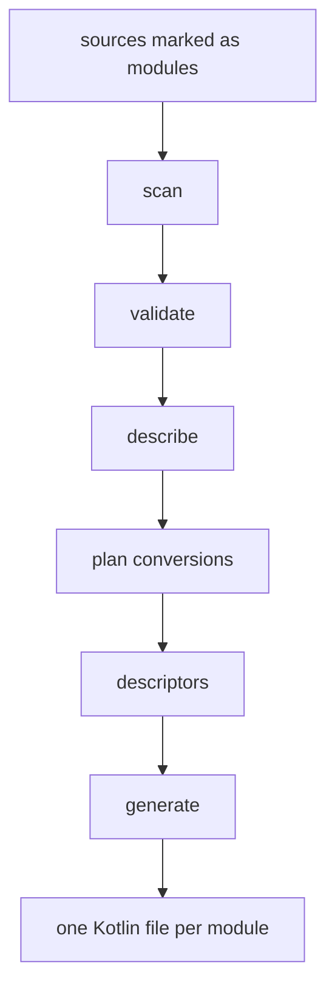
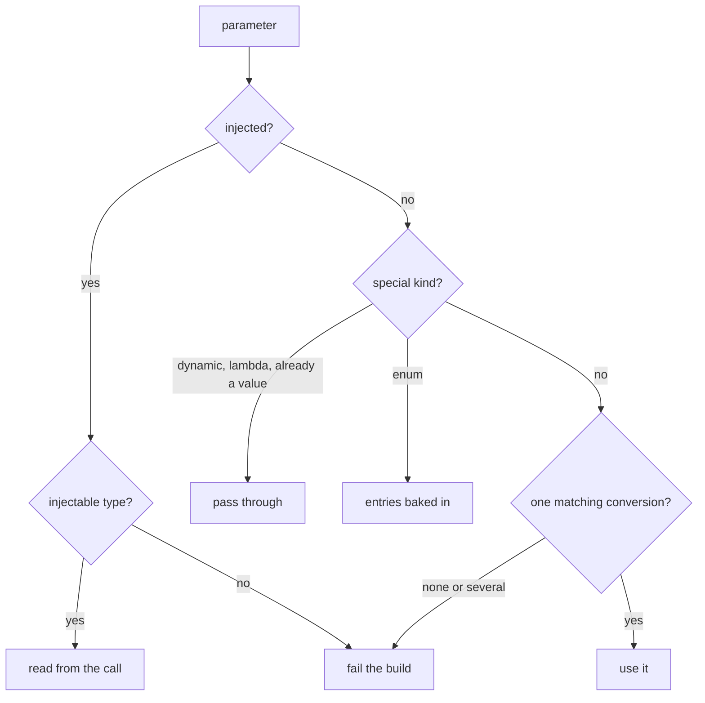
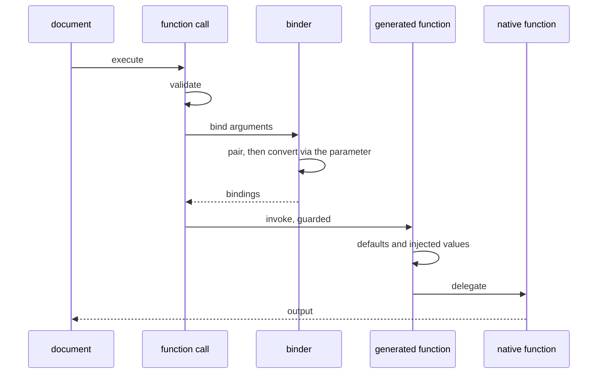

# Architecture

How a Kotlin function annotated with `@QFunction` becomes a function a Quarkdown document can call.

## Why this module exists

Calling a native function by name requires knowing its parameters, converting each argument to the
declared type, and invoking it. That used to happen at render time through reflection. Every input to
it is known when Quarkdown is built, so this processor works it out then and emits ordinary Kotlin.

## Build-time pipeline

One pass per KSP round, with round-scoped state shared by every stage.

Each stage does one thing, and descriptors are the only thing the generator reads, which keeps KSP
out of the emitter.

Some inputs are not part of KSP's public API: default value expressions, doc comments, imports and
annotation source text. They are read from the PSI that KSP holds internally. This is the module's
one reflective corner, and it fails quietly, since a lost default should not break a build. A
processor option turns those failures into log output, which is what to reach for after a KSP
upgrade.

## Planning a conversion

The step that replaced the runtime lookup. The available conversions are read from the annotations on
`ValueFactory`, so it stays the single source of truth and this module hardcodes no table.

An ambiguous match fails rather than picking one, because the old runtime behavior relied on a
declaration order that no backend guarantees.

## What is generated

Per exported function: its parameter metadata, a callable for the module to export, a documented
wrapper whose signature is a published contract, and a loosely typed counterpart that the call path
enters and that fills in defaults and injected values.

The generated source is the authority on its own shape. Read a file under `build/generated/ksp`
rather than a copy in prose.

## Render-time flow

