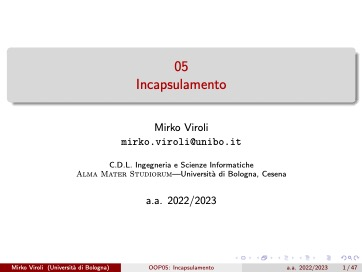

Setting up:

```
.docname {OOP05: Incapsulamento}
.docauthor {Mirko Viroli}
.aspectratio {16:9}

.theme {ThemeName}

.footer {      <-- Placement and aesthetics are handled by the theme
    Mirko Viroli (Università di Bologna)
        
    .docname

    a.a. 2022/2023

    .currentpage / .pagecount
}
```



```
.titlepage      <-- Starts a title page (different theme-defined look)

# Incapsulamento

Mirko Viroli  
`mirko.viroli@unibo.it`

.fontsize {12} {
    C.D.L. Ingegneria e Scienze Informatiche  
    Alma Mater Studiorum - Università di Bologna, Cesena
}

a.a. 2022/2023
```