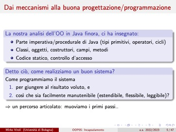
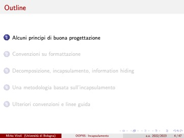
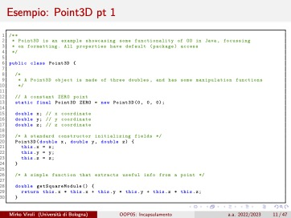

Setting up:

```
.docname [OOP05: Incapsulamento]
.docauthor [Mirko Viroli]
.aspectratio [4:3]

.colortheme [ThemeName]
.layouttheme [ThemeName]

.footer        <-- Placement and aesthetics are handled by the themes
    Mirko Viroli (Università di Bologna)
        
    .docname

    a.a. 2022/2023

    .currentpage / .pagecount
```


```
.titlepage      <-- Starts a title page (different theme-defined look)

# Incapsulamento

Mirko Viroli  
`mirko.viroli@unibo.it`

.fontsize [small]
    C.D.L. Ingegneria e Scienze Informatiche  
    Alma Mater Studiorum - Università di Bologna, Cesena


a.a. 2022/2023
```



```
.page

# Dai meccanismi alla buona progettazione/programmazione

.box [La nostra analisi]
    - Parte imperativa/procedurale
    - Classi, oggetti, costruttori, campi, metodi
    - Codice statico, controllo d'accesso

.box [Detto ciò, come realizziamo un buon sistema?]
    Come programmiamo il sistema

    1. per giungere al risultato voluto, e
    2. così che sia facilmente manutenibile

$$\Rightarrow$$ un percorso articolato: muoviamo i primi passi...
```



```
.page [Alcuni principi di buona progettazione]
            <-- Naming a page defines a section
                and makes it show up in the table of contents

# Outline

.dynamictableofcontents    <-- Highlights the current section
```



    .page

    # Esempio: Point3D pt 1

    ```java
    public class Point3D {
        ...
    }
    ```

Alternative from file:

```
.page

# Esempio: Point3D pt 1

.codeblock [java]
    .filecontent [file.java] [1..30]   <-- Loads lines 1-30 from file.java
```